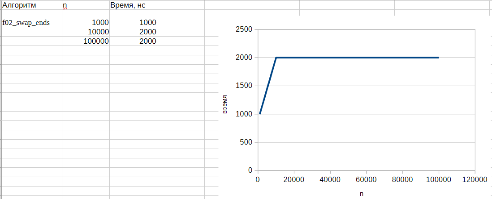
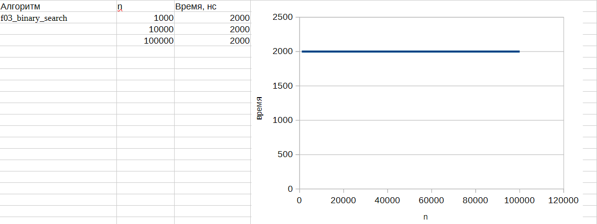
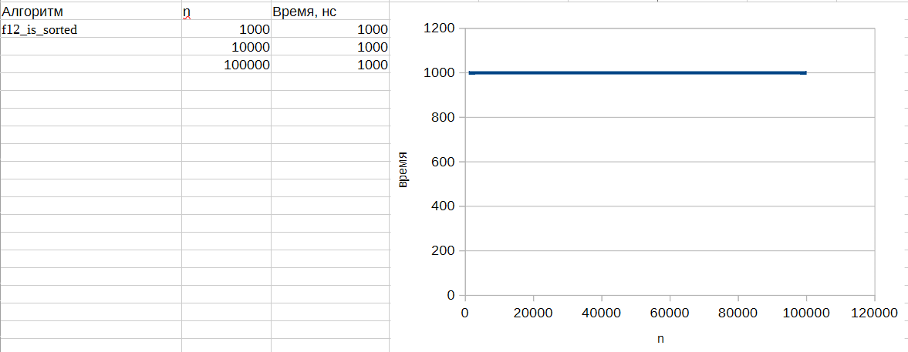
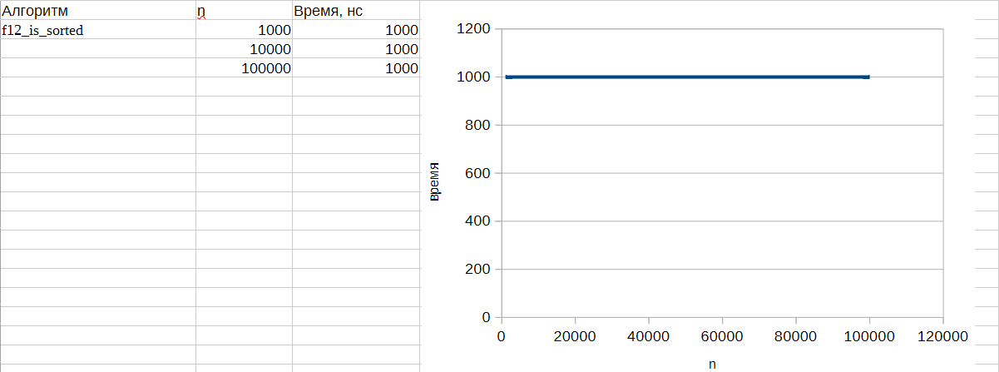
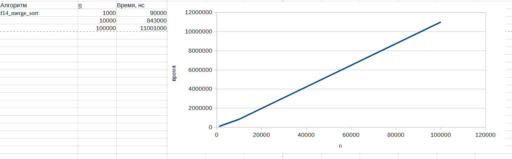
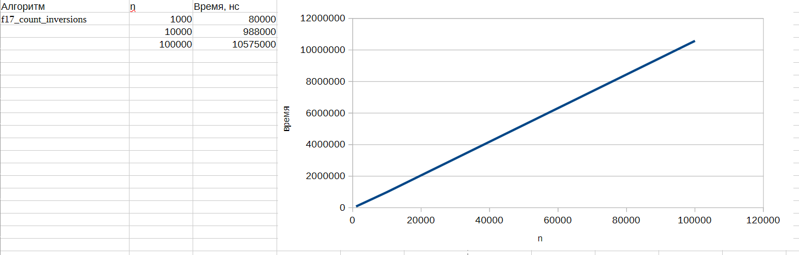
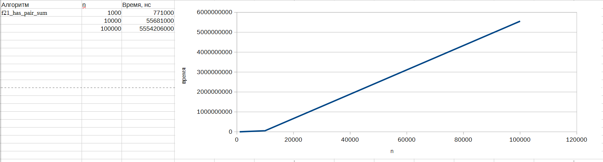
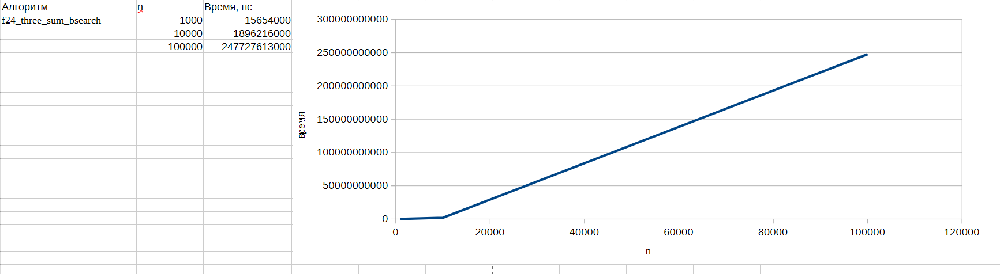
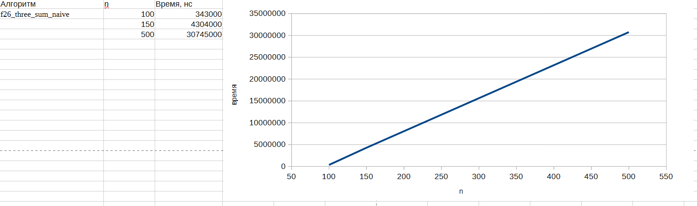
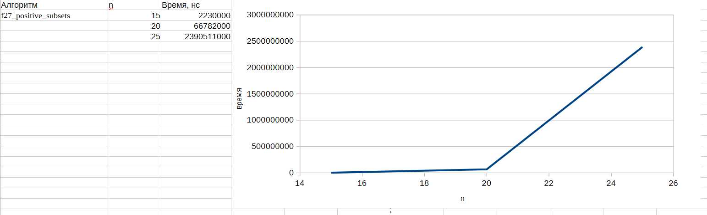

# Группа ИДБ-25-06, 16.03.2026, Лабораторная работа №1, Якунина В.С.

## Вводные данные

- язык программирования: C
- операционная система: Windows

Все таблицы с результатами и графиками зависимости времени выполнения от количества элементов:
[text](all_f.xlsx)

## f02_swap_ends

**O(1)** Обмен первого и последнего элемента

Код:
[text](f02_swap_ends.c)

Таблица с результатом и графиком зависимости времени выполнения от количества элементов: 
[text](<f02_swap_ends .xlsx>)

## f03_binary_search

**O(log n)** Бинарный поиск (итеративный)

Код:
[text](f03_binary_search.c)

Таблица с результатом и графиком зависимости времени выполнения от количества элементов:
[text](<f03_binary_search .xlsx>)

## f06_linear_search

**O(n)** Линейный поиск

Код:
[text](f06_linear_search.c)

Таблица с результатом и графиком зависимости времени выполнения от количества элементов:
[text](<f06_linear_search .xlsx>)

## f12_is_sorted

**O(n)** Проверка, отсортирован ли массив по неубыванию

Код:
[text](f12_is_sorted.c)

Таблица с результатом и графиком зависимости времени выполнения от количества элементов:
[text](<f12_is_sorted .xlsx>)

## f14_merge_sort

**O(n log n)** Сортировка слиянием (merge sort)

Код:
[text](f14_merge_sort.c)

Таблица с результатом и графиком зависимости времени выполнения от количества элементов:
[text](<f14_merge_sort .xlsx>)

## f17_count_inversions

**O(n log n)** Подсчёт инверсий в массиве

Код:
[text](f17_count_inversions.c)

Таблица с результатом и графиком зависимости времени выполнения от количества элементов:
[text](<f17_count_inversions .xlsx>)

## f21_has_pair_sum

**O(n²)** Наивный поиск пары элементов с заданной суммой (two-sum)

Код:
[text](f21_has_pair_sum.c)

Таблица с результатом и графиком зависимости времени выполнения от количества элементов:
[text](<f21_has_pair_sum .xlsx>)

## f24_three_sum_bsearch

**O(n² log n)** Поиск тройки с суммой target (с бинарным поиском)

Код:
[text](f24_three_sum_bsearch.c)

Таблица с результатом и графиком зависимости времени выполнения от количества элементов:
[text](<f24_three_sum_bsearch .xlsx>)

## f26_three_sum_naive

**O(n³)** Наивный поиск тройки с суммой target — O(n^3)

Код:
[text](f26_three_sum_naive.c)

Таблица с результатом и графиком зависимости времени выполнения от количества элементов:
[text](<f26_three_sum_naive .xlsx>)

## f27_positive_subsets

**O(n · 2ⁿ)** Подсчёт подмножеств с положительной суммой

Код:
[text](f27_positive_subsets.c)

Таблица с результатом и графиком зависимости времени выполнения от количества элементов:
[text](<f27_positive_subsets .xlsx>)

